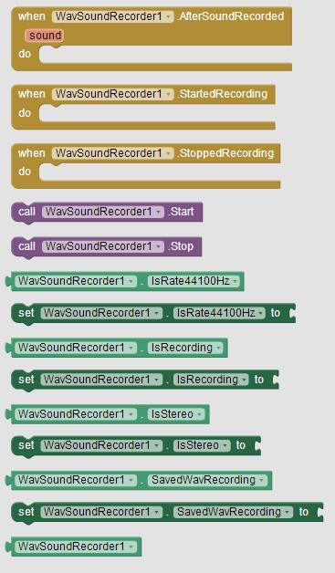
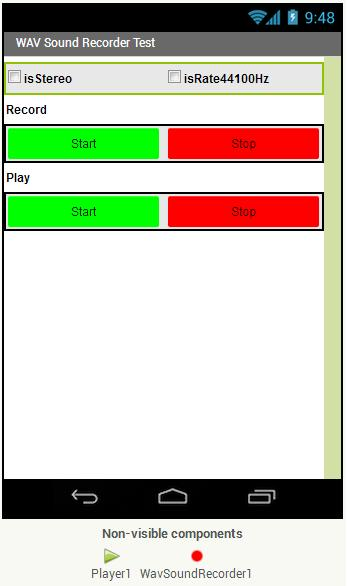

# WavSoundRecorderExtension

Wav Sound Recorder Extension for MIT App Inventor 2 and its clones. 
Here you will find its extension aix file, together with a simple demo application.
This extension add the functionality to record sound in wav format in stereo or mono with sample rate 44100Hz or 16000Hz.

